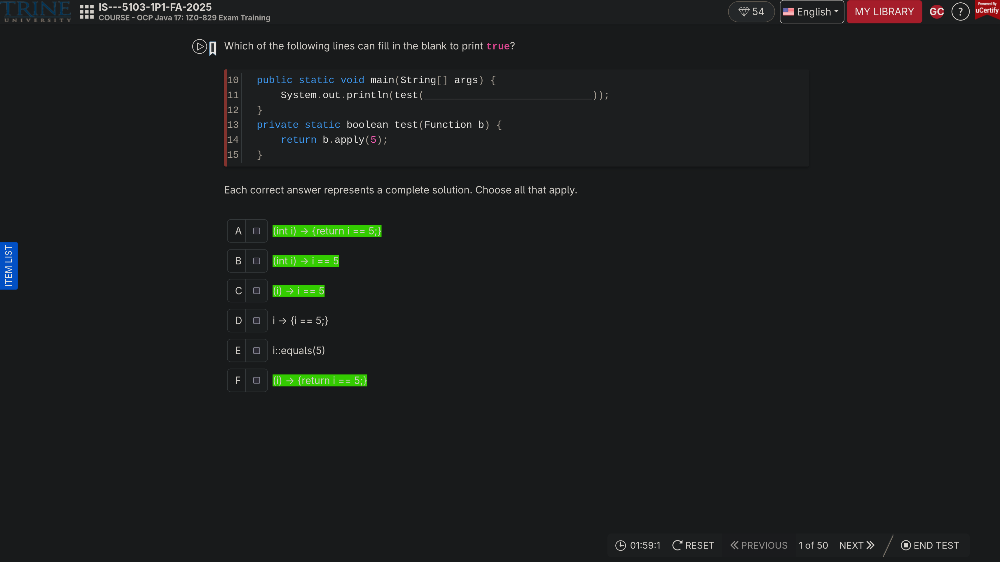

# [gemini](https://gemini.google/overview/gemini-in-chrome/)


# [dead] ucertify-quiz-helper
[ucertify](https://docs.google.com/document/d/1EChf2k3wRUR1emCSNFwIyPv4wkFgdsQQMx4_BbEeIe8/edit?usp=sharing)


## run
- install [tampermonkey](https://www.tampermonkey.net/)
- install [script](https://github.com/0guanhua0/ucertify-quiz-helper/raw/refs/heads/main/helper.user.js)
- set [gemini api key](https://aistudio.google.com/app/apikey) in script


- check browser console


### chrome
turn on developer mode

go to [chrome://extensions/](chrome://extensions/)


### help
thx jackwww232-hash for db patch pipeline

to help patch db, in result
```
getAll()
```


```
console.log(JSON.stringify(patch, null, 2))
```

